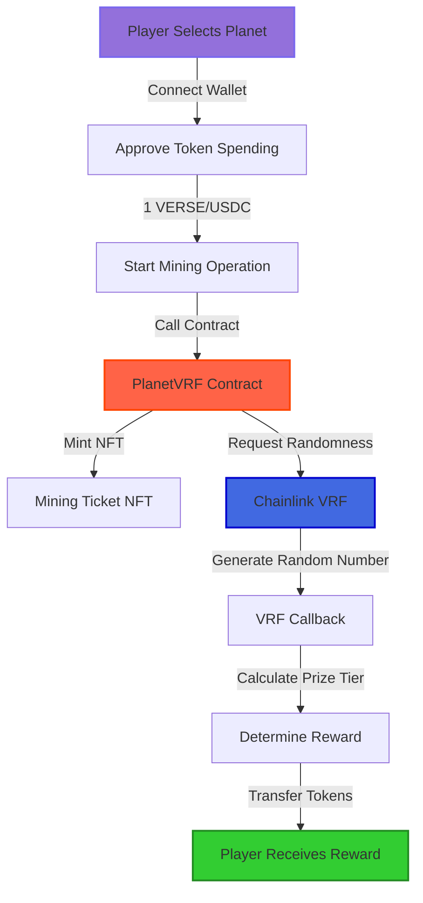
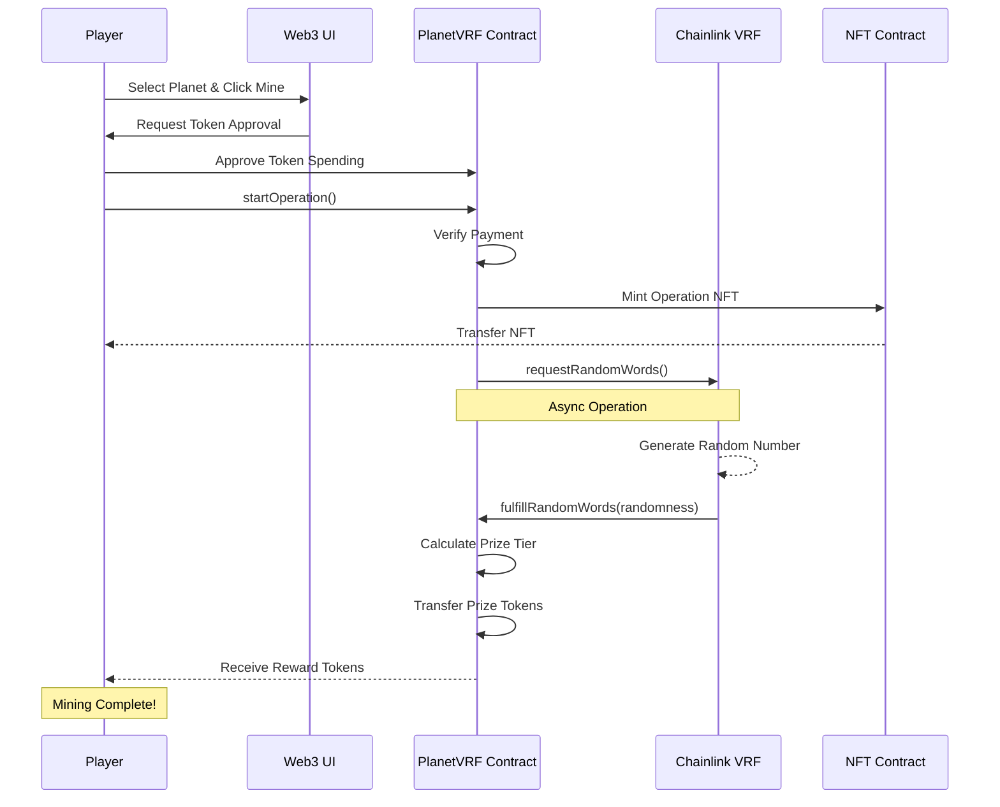
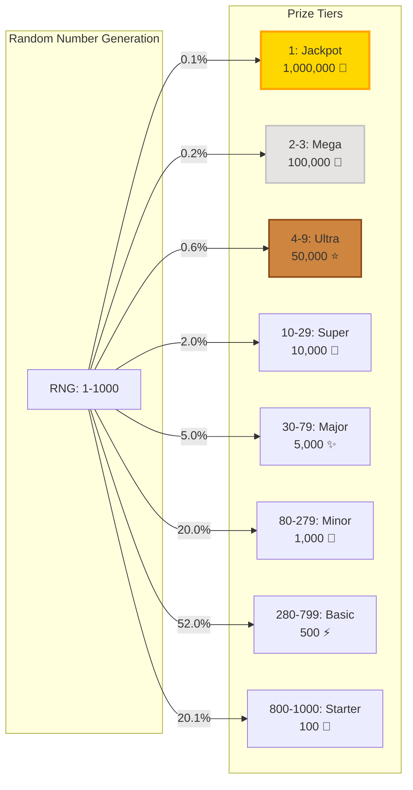
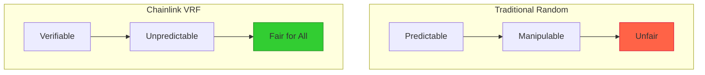

# 🌌 Verse-Scra: Web3 Space Mining Game

A blockchain-based space mining game featuring 8 unique planets and a decentralized lottery system powered by Chainlink VRF.

## 🚀 Overview

Verse-Scra is a Web3 space-themed mining game where players can mine resources from 8 different planets. Players purchase mining operations (as NFTs) and use Chainlink's verifiable randomness to determine their rewards, ranging from 100 to 1,000,000 tokens. Every mining expedition guarantees some reward - it's not about if you'll find resources, but how much!

## 🎯 Features

- **Space Mining Theme**: Explore 8 unique planets in an immersive space environment
- **Verifiable Randomness**: Chainlink VRF ensures provably fair reward distribution
- **NFT Mining Tickets**: Every operation is minted as an NFT (ERC-721) for transparency
- **Guaranteed Rewards**: Every mining operation yields resources - no empty expeditions!
- **Multi-Chain Support**: Currently deployed on Polygon and Base networks
- **Prize Tiers**: 8 different reward levels from 100 to 1,000,000 tokens
- **Beautiful 3D UI**: Interactive interface with rotating planets and smooth animations

### 🪐 Available Planets
The game features 8 planets to explore: `Solanium`, `Ethereus`, `ZANO`, `Ferrum`, `Lumina`, `TITANOX`, `Base`, and `Voidara` - each with unique visual designs and future gameplay potential.

## 📋 Deployed Contracts

### Polygon Network
- **PlanetVRF Contract**: [`0x999010daEf449c2cfCf36cB698047D1a7798EAd6`](https://polygonscan.com/address/0x999010daEf449c2cfCf36cB698047D1a7798EAd6)
- **Payment Token**: VERSE Token
- **Operation Cost**: 1 VERSE

### Base Network
- **PlanetVRF Contract**: [`0x66b0fbbeb420b63155d61ec5922293148bb796ec`](https://basescan.org/address/0x66b0fbbeb420b63155d61ec5922293148bb796ec)
- **Payment Token**: USDC
- **Operation Cost**: 1 USDC

## 🎮 How It Works

Understanding Verse-Scra's mechanics involves three key perspectives: the player's journey through the game, the technical contract interactions happening behind the scenes, and the prize distribution system that determines rewards. Let's explore each of these aspects in detail.

### User Journey

The Verse-Scra experience begins when a player connects their Web3 wallet to our dApp. After browsing through the 8 available planets, each with its unique visual theme, players select their mining destination. The journey from planet selection to receiving rewards is designed to be seamless and exciting, with every step transparent on the blockchain.



This high-level flow shows the simplicity from the player's perspective, but there's much more happening under the hood to ensure fairness and security.

### Contract Interaction Flow

Behind the scenes, the PlanetVRF smart contract orchestrates a complex dance of interactions with multiple systems. When a player initiates a mining operation, the contract doesn't just randomly assign rewards - it requests true randomness from Chainlink's VRF (Verifiable Random Function) oracle network. This ensures that every mining result is provably fair and cannot be manipulated by anyone, including the contract owners. The following sequence diagram illustrates this sophisticated process:



The entire process, from initiating the mining operation to receiving rewards, typically takes just a few moments. The asynchronous nature of the VRF callback ensures that the blockchain isn't congested while maintaining the integrity of the random number generation.

## 🎰 Prize Distribution

### How Rewards Are Calculated

The heart of Verse-Scra's excitement lies in its prize distribution system. Using a random number between 1 and 1000 generated by Chainlink VRF, the contract determines which prize tier a player has won. The distribution is carefully balanced to ensure sustainability while maintaining the thrill of potentially winning the jackpot. Lower rewards are more common to keep players engaged, while the rare high-value prizes create aspirational goals. Here's how the random number maps to different prize tiers:



### Prize Tier Details

| RNG Range | Prize Amount | Probability |
|-----------|--------------|-------------|
| 1         | 1,000,000 tokens | 0.1% |
| 2-3       | 100,000 tokens   | 0.2% |
| 4-9       | 50,000 tokens    | 0.6% |
| 10-29     | 10,000 tokens    | 2.0% |
| 30-79     | 5,000 tokens     | 5.0% |
| 80-279    | 1,000 tokens     | 20.0% |
| 280-799   | 500 tokens       | 52.0% |
| 800-1000  | 100 tokens       | 20.1% |

As you can see from the distribution, every player is guaranteed to win at least 100 tokens, making each mining expedition worthwhile. The most common rewards (100-500 tokens) occur about 72% of the time, ensuring regular positive reinforcement, while the dream of hitting the million-token jackpot keeps the excitement alive.

## 🎯 Game Mechanics

### The Mining Experience

1. **Choose Your Planet**: Each of the 8 planets offers unique visual themes and mining opportunities. While currently all planets use the same prize structure, future updates will bring planet-specific resources and bonuses.

2. **Start Your Expedition**: Purchase a mining operation for 1 VERSE (Polygon) or 1 USDC (Base). This mints an NFT ticket representing your mining claim.

3. **Await Oracle Results**: Chainlink VRF determines your mining success. The oracle ensures fairness - no one can predict or manipulate results.

4. **Claim Your Resources**: Every expedition finds something! Your rewards are automatically transferred to your wallet based on the prize tier you hit.

### Why NFT Mining Tickets?

- **Transparency**: Every mining operation is recorded on-chain
- **Ownership**: Your mining history is yours forever
- **Future Utility**: NFTs may unlock special features, bonuses, or access to exclusive planets
- **Trading**: Rare NFTs from lucky mining operations could become collectibles

### The Chainlink VRF Advantage



## 🏗️ Smart Contract Architecture

```
PlanetVRF.sol
├── PlanetNFT.sol (ERC-721 NFT functionality)
│   └── CommonNFT.sol (Base NFT implementation)
└── CommonVRF.sol (Chainlink VRF integration)
    └── PrizeTiers.sol (Prize distribution logic)
```

### Core Contracts

- **PlanetVRF.sol**: Main contract handling operations and prize distribution
- **CommonVRF.sol**: Base implementation for Chainlink VRF integration
- **PlanetNFT.sol**: NFT functionality for minting operation tickets
- **PrizeTiers.sol**: Prize tier configuration and calculation logic

## 🛠️ Technology Stack

- **Smart Contracts**: Solidity 0.8.25
- **Development Framework**: Foundry
- **Frontend**: React + Vite
- **Web3 Integration**: ThirdWeb SDK
- **Randomness**: Chainlink VRF v2
- **Networks**: Polygon & Base
- **Package Manager**: Bun

## 💻 Development Setup

### Prerequisites

- [Bun](https://bun.sh/) (JavaScript runtime & package manager)
- [Foundry](https://book.getfoundry.sh/getting-started/installation) (Solidity development toolkit)
- Node.js 18+ (if not using Bun)

### Installation

1. Clone the repository:
```bash
git clone <repository-url>
cd verse-scra
```

2. Install dependencies:
```bash
bun install
```

3. Install Foundry dependencies:
```bash
forge install
```

### Environment Setup

Create a `.env` file in the root directory:
```bash
# Private key for deployments
PRIVATE_KEY=your_private_key_here

# RPC URLs
POLYGON_RPC_URL=https://polygon-rpc.com
BASE_RPC_URL=https://base-mainnet.public.blastapi.io

# Etherscan API keys for verification
POLYGONSCAN_API_KEY=your_polygonscan_api_key
BASESCAN_API_KEY=your_basescan_api_key

# Thirdweb Client ID for Web3 UI
VITE_THIRDWEB_CLIENT_ID=your_thirdweb_client_id_here
```

## 🧪 Testing

Run the smart contract tests:
```bash
forge test
```

Run tests with gas reporting:
```bash
forge test --gas-report
```

## 🚀 Deployment

### Deploy to Polygon
```bash
bun run deploy:planetvrf:polygon
```

### Deploy to Base
```bash
bun run deploy:planetvrf:base
```

### Verify Contracts
Contracts are automatically verified during deployment if API keys are configured.

## 🌐 Frontend Development

Start the development server:
```bash
bun run dev
```

Build for production:
```bash
bun run build
```

Preview production build:
```bash
bun run preview
```

## 📝 Contract Interaction

### Starting an Operation

Users can start a planet operation by:
1. Approving the contract to spend VERSE/USDC tokens
2. Calling `startOperation()` function
3. Receiving an NFT representing their operation
4. Waiting for VRF callback to determine prize

### Claiming Prizes

Prizes are automatically distributed after the VRF callback is processed. Winners receive their tokens directly to their wallet.

## 🔧 Configuration

### Chainlink VRF Settings

**Polygon:**
- VRF Coordinator: `0xAE975071Be8F8eE67addBC1A82488F1C24858067`
- Key Hash: `0x6e099d640cde6de9d40ac749b4b594126b0169747122711109c9985d47751f93`
- Subscription ID: 1274

**Base:**
- VRF Coordinator: `0xd5D517aBE5cF79B7e95eC98dB0f0277788aFF634`
- Key Hash: `0x83d1b6e3388bed3d76426974512bb0d270e9542a765cd667242ea26c0cc0b730`

## 🔐 Security

- Contracts use Chainlink VRF for verifiable randomness
- Pausable functionality for emergency stops
- Owner-only administrative functions
- Reentrancy guards on critical functions

## 🚀 Future Roadmap

### Phase 1 - Current Implementation ✅
- 8 Interactive planets with unique visual designs
- Basic mining operations with guaranteed rewards
- Chainlink VRF integration for fair randomness
- NFT-based mining tickets
- Multi-chain deployment (Polygon & Base)

### Phase 2 - Enhanced Gameplay 🔜
- **Planet-Specific Resources**: Each planet yields unique tokens
- **Mining Equipment NFTs**: Boost your chances with special tools
- **Mining History**: Track your expeditions and success rates
- **Leaderboards**: Compete with other space miners
- **Planet Bonuses**: Time-based or event-driven multipliers

### Phase 3 - Advanced Features 🌟
- **Mining Guilds**: Team up for collaborative mining
- **Planet Ownership**: Stake tokens to own mining rights
- **Cross-Chain Bridges**: Move resources between planets/chains
- **Governance Token**: Vote on game mechanics and new features
- **Mobile App**: Native iOS/Android experience

### Phase 4 - The Metaverse 🌌
- **3D Planet Exploration**: Immersive VR/AR experiences
- **Planet Conquest**: PvP battles for territory control
- **Terraforming**: Upgrade planets for better yields
- **Intergalactic Trading**: Marketplace for resources and NFTs

## 📄 License

This project is licensed under the VIBE License.

## 🤝 Contributing

1. Fork the repository
2. Create your feature branch (`git checkout -b feature/amazing-feature`)
3. Commit your changes (`git commit -m 'Add some amazing feature'`)
4. Push to the branch (`git push origin feature/amazing-feature`)
5. Open a Pull Request

## 📞 Support

For questions and support, please open an issue in the GitHub repository.

---

Built with ❤️ for the Web3 community